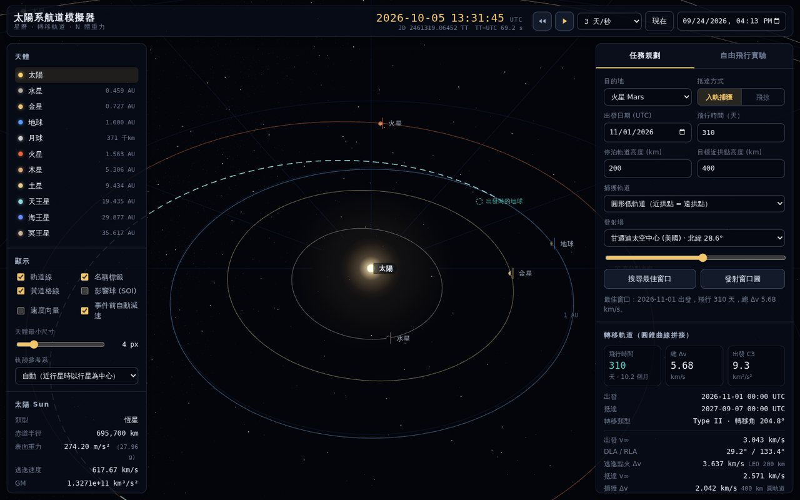
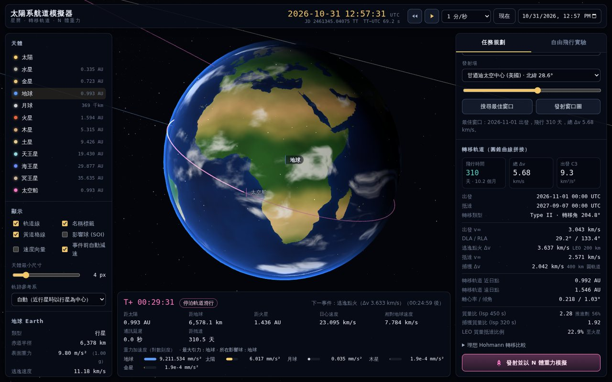
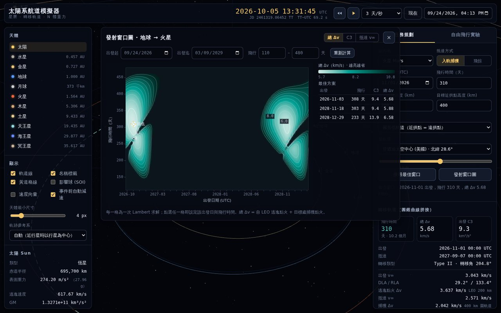
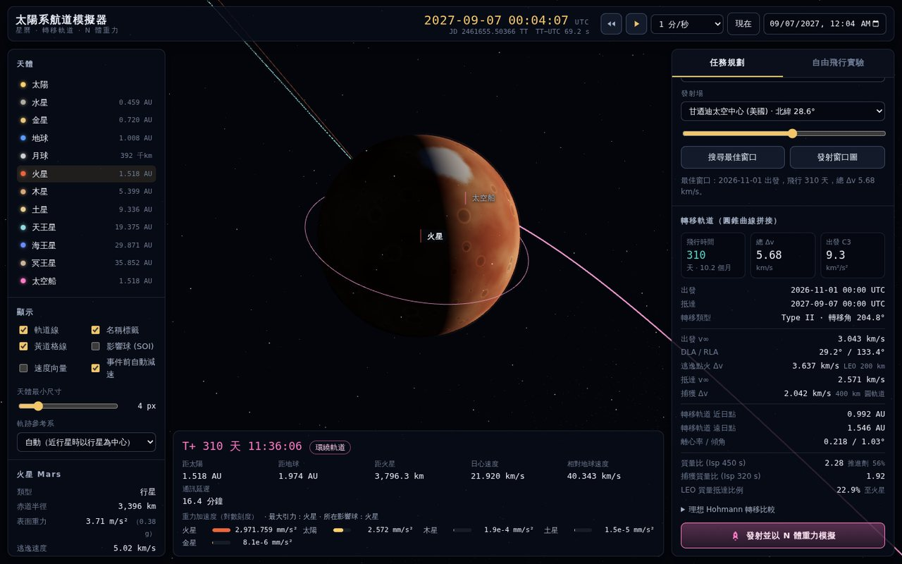
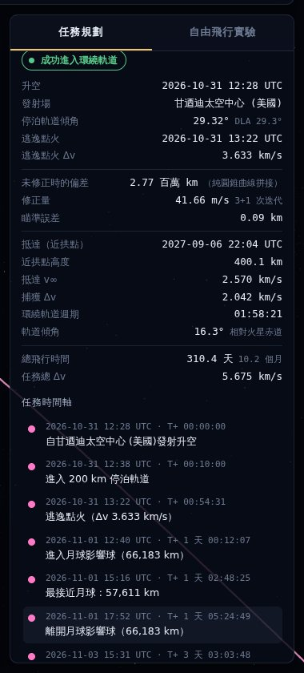

# 太陽系航道模擬器

在瀏覽器中以 3D 呈現真實日期的太陽系，並模擬從地球發射火箭前往其他行星的完整航程：
從發射場升空、停泊軌道、逃逸點火，到行星際巡航、N 體重力修正，最後在目標行星捕獲入軌或飛掠。



## 功能

**天體運行與時間**
- 任一日期（西元前 3000 年至西元 3000 年）的行星、冥王星與月球位置，時間可播放、倒轉、調速（即時 1× 到 1 年/秒）或直接跳到指定 UTC 時刻
- 時間系統區分 UTC 與地球時 TT（含閏秒表與 ΔT），並顯示儒略日
- 行星依 IAU 自轉模型定向與自轉；地球貼圖使用 Natural Earth 真實海岸線，可看到晝夜分界與發射場位置
- 天體資訊：表面重力、逃逸速度、影響球半徑、活力公式驗證的公轉速度、光行時間、月相

**任務規劃（圓錐曲線拼接）**
- 以 Lambert 問題求解任意出發日與飛行時間的轉移軌道，列出 C3、DLA/RLA、出發與抵達 v∞、逃逸與捕獲 Δv、轉移角（Type I/II）
- Porkchop 發射窗口圖：出發日期 × 飛行時間的 Δv 熱度圖與等值線，點選任一格即採用該方案，並列出最佳方案表
- 「搜尋最佳窗口」自動找出最省 Δv 的出發日與飛行時間
- 與理想 Hohmann 轉移比較：飛行時間、相位角、會合週期
- Tsiolkovsky 火箭方程式：推進劑質量比與可抵達目標的質量比例
- 捕獲軌道可選圓形低軌道或大橢圓軌道（巨行星建議後者，與朱諾號等實際任務相同）

**發射與 N 體模擬**
- 依發射場緯度與出發漸近線赤緯 (DLA) 決定停泊軌道傾角，計算當天發射時刻，呈現升空、停泊軌道滑行與逃逸點火
- 以太陽、八大行星、冥王星與月球的重力數值積分太空船軌道（自適應 Dormand–Prince 5(4)）
- 以牛頓法打靶修正出發速度，讓太空船通過目標的 B 平面瞄準點；顯示未修正時會錯過目標多遠
- 抵達時偵測近拱點並點火捕獲，或分析飛掠的重力助推（偏轉角、日心速度變化）
- 任務時間軸：進出影響球、最接近月球等事件，點選即可跳到該時刻；事件前可自動減速
- 遙測：任務時間、距離、速度、通訊延遲、各天體重力加速度（對數刻度）與所在影響球

**自由飛行實驗**
- 指定 v∞、方位角與仰角直接發射，觀察軌道變化、重力助推、脫離太陽系或墜向太陽

| | |
|---|---|
|  |  |
|  |  |

## 快速開始

需要 Node.js 18 以上。

```bash
npm install
npm run dev          # 開發伺服器，瀏覽 http://localhost:5173
npm test             # 執行物理測試（Vitest）
npm run build        # 輸出 dist/，可部署到任何靜態網站主機
npm run build:single # 輸出 dist-single/index.html，單一檔案、可離線開啟
```

## 操作

| 操作 | 說明 |
|---|---|
| 拖曳 / 滾輪 | 旋轉視角 / 縮放（可從太陽系尺度一路拉近到太空船） |
| 點選天體或標籤 | 設為焦點並移動鏡頭；雙擊拉近 |
| 空白鍵 | 播放 / 暫停 |
| `[` `]` | 減速 / 加速 |
| `R` | 時間倒轉 |
| `F` | 跟隨太空船 |
| `Esc` | 關閉發射窗口圖 |

建議流程：選擇目的地 →「搜尋最佳窗口」或開啟「發射窗口圖」挑選方案 →「發射並以 N 體重力模擬」→ 在任務時間軸上點選事件觀看升空、逃逸與入軌。

## 物理模型

### 時間
- TT − UTC = 32.184 s + 閏秒（1972 年起；2017 年後為 69.184 s）；1972 年以前使用 Espenak & Meeus 的 ΔT 多項式
- 星曆以 TT 計算（與 TDB 差距小於 2 ms）

### 星曆
- 行星：JPL〈Keplerian Elements for Approximate Positions of the Major Planets〉（E. M. Standish）。1800–2050 年用表 1，其他年份用表 2a/2b（含木星至冥王星的長週期修正）
- 月球：Meeus《Astronomical Algorithms》第 47 章（截斷 ELP-2000/82），並由當日平黃道歲差轉換到 J2000
- 地球位置 = 地月質心 − 月球地心位置 × 月球質量比
- 座標系：日心 J2000 黃道座標；重力參數取自 JPL DE440

與 JPL DE421 在 1950–2050 年間 48 個時刻比對的最大方向誤差（`tests/ephemeris.test.js`）：

| 天體 | 誤差 | 天體 | 誤差 |
|---|---|---|---|
| 水星 | 18″ | 木星 | 8.6′ |
| 金星 | 22″ | 土星 | 9.2′ |
| 地球 | 16″ | 天王星 | 1.9′ |
| 火星 | 75″ | 海王星 | 57″ |
| 月球 | 6″（距離 7 km） | 冥王星 | 57″ |

### 軌道力學
- 克卜勒方程式、軌道根數與狀態向量互換、普適變數傳播（牛頓法加二分法保護，適用橢圓與雙曲線）
- Lambert 問題：Izzo (2015) 演算法，Householder 迭代
- N 體模型：日心座標系中每個天體的直接項加間接項 `−μ·r_b/|r_b|³`；星曆以三次 Hermite 插值快取；步長依接近天體的時間尺度限制，避免一步跨過飛掠
- 事件偵測：最接近點（相對徑向速度變號後二分求根）、撞擊、進出影響球

### 任務設計
- 停泊軌道面同時包含 v∞ 方向並與發射場緯度相容；逃逸雙曲線近拱點方向由 θ∞ = arccos(−1/e) 決定
- 發射時刻：地球自轉使發射場通過停泊軌道面的瞬間，再加上約 10 分鐘上升段與滑行段
- 打靶：先在目標影響球內將目標視為無質量，以 3×3 牛頓法使軌跡通過 B 平面瞄準點；再以完整重力、2×3 最小範數牛頓法修正密切雙曲線的近拱點高度
- 捕獲：近拱點處減速進入圓軌道或橢圓軌道；飛掠：比較進出影響球的日心速度

## 驗證

`npm test` 執行 50 項測試，包含：
- 儒略日、閏秒、ΔT 與 UTC/TT 往返換算
- 行星與月球星曆對 JPL DE421 的誤差上限（表 1 與表 2 各自驗證）
- Curtis、Vallado 課本的 Lambert 與克卜勒傳播例題，以及 3,000 組隨機轉移的自洽檢查
- DOPRI5 積分器與二體解析解的比對（800 天誤差 < 1 km）
- Hohmann 地球→火星 259 天與 Δv、影響球半徑、火箭方程式
- 2026 年底火星窗口的 C3、N 體捕獲高度誤差 < 10 km、土星飛掠的重力助推、木星橢圓捕獲

參考星曆由 `scripts/gen_de421_fixtures.py`（jplephem + DE421）產生於 `tests/fixtures/de421.json`。

## 專案結構

```
src/
  physics/      時間、常數、星曆、月球、克卜勒、Lambert、積分器、N 體、任務設計
  render/       Three.js 場景、程序化貼圖、太陽、星空、天體、軌跡線、太空船
  ui/           Porkchop 圖、格式化與 DOM 工具
  main.js       介面與模擬時鐘
tests/          Vitest 測試與 DE421 參考資料
scripts/        參考星曆產生腳本
```

## 簡化與限制
- 點火為瞬間變速（脈衝），未模擬有限推力、引擎比衝變化或大氣阻力；上升段為示意性的運動學曲線
- 行星星曆為 JPL 近似根數，木星與土星誤差約 10 角分，適合視覺化與任務初步設計，不適合精密導航
- 未考慮相對論效應、太陽輻射壓、行星扁率 (J2) 與地球的章動
- 捕獲後的環繞軌道以二體運動外推

## 資料來源與授權
- 陸地輪廓：[Natural Earth](https://www.naturalearthdata.com/)（公有領域），經 `world-atlas` 套件
- 行星軌道根數：JPL Solar System Dynamics；月球理論：J. Meeus《Astronomical Algorithms》
- 3D 繪圖：[three.js](https://threejs.org/)（MIT）
